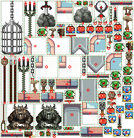
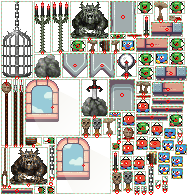
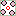

spright test suite
==================

This is the test suite from the [spright](https://github.com/houmain/spright) project.

The output is updated by executing the  bash script [update.sh](update.sh).

All image files are derived from files released as [CC0](https://creativecommons.org/publicdomain/zero/1.0/) on [OpenGameArt](https://opengameart.org).

--------

## Sample from documentation

Packing sprites from different sources:

<kbd></kbd>  <kbd></kbd> <kbd></kbd> <kbd></kbd> <kbd></kbd> <kbd></kbd>

With minimal configuration: [spright.conf](docs-auto/spright.conf)

<kbd></kbd>

With additional information provided, like the _span_ of window sprites: [spright.conf](docs/spright.conf)

<kbd></kbd>

--------

## Compact

Packing sprites by their convex outline: [spright.conf](compact/spright.conf)

<kbd></kbd>
<kbd></kbd>

--------

## Layers

Packing multiple sheets with a shared set of output coordinates [spright.conf](layers/spright.conf)

<kbd></kbd>
<kbd></kbd>
<kbd></kbd> 
<kbd></kbd>
<kbd></kbd>
<kbd></kbd>

--------

## Deduplicate

Finding unique tiles in an image: [spright.conf](deduplicate/spright.conf)

<kbd></kbd>
<kbd></kbd>

--------

## Split

Splitting a sprite sheet in individual files: [spright.conf](split/spright.conf)

<kbd></kbd> 
<kbd></kbd>
<kbd></kbd>
<kbd></kbd>
<kbd></kbd>
<kbd></kbd> 
<kbd></kbd>
<kbd></kbd>
<kbd></kbd>
<kbd></kbd>
<kbd></kbd> 
<kbd></kbd>
<kbd></kbd>
<kbd></kbd>
<kbd></kbd>
<kbd></kbd> 
<kbd></kbd>
<kbd></kbd>
<kbd></kbd>

--------

## Grid offset/spacing

Splitting multiple arrangements at once: [spright.conf](grid/spright.conf)

<kbd></kbd> 
<kbd></kbd>

--------

## Scalings

Generating multiple resolutions of output: [spright.conf](scalings/spright.conf)

<kbd></kbd> 
<kbd></kbd>
<kbd></kbd>
<kbd></kbd>
<kbd></kbd>
<kbd></kbd>

--------

## Extrude

Adding a padding around sprites and fill it with the  border pixel color: [spright.conf](extrude/spright.conf)

<kbd></kbd> 
